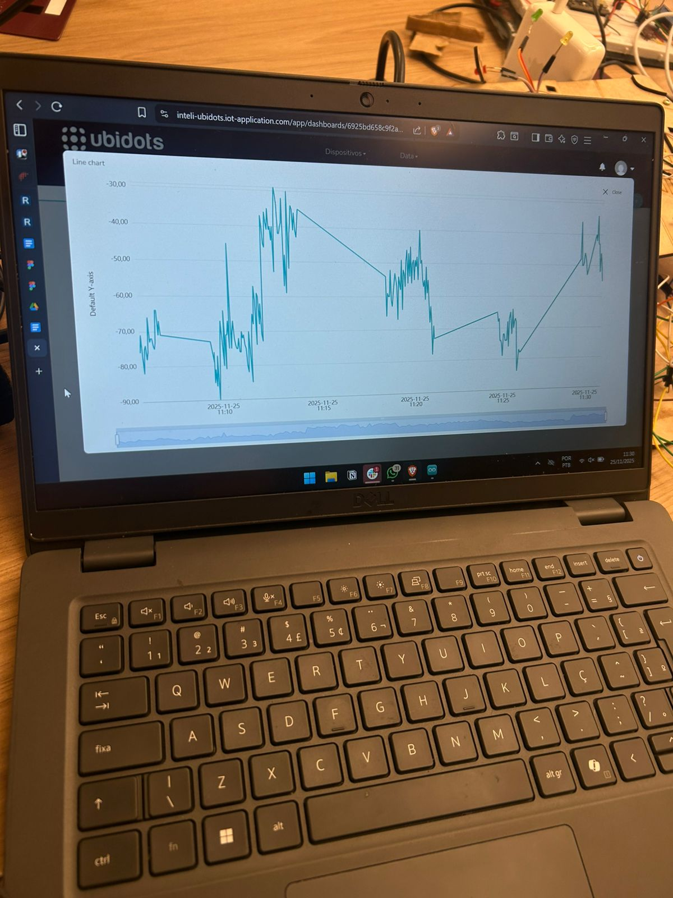

# Projeto IoT de Monitoramento de Intensidade de Sinal Wi-Fi (RSSI) com ESP32 e MQTT
## Introdução

&nbsp;Este projeto tem como objetivo desenvolver um sistema IoT capaz de monitorar em tempo real a intensidade do sinal Wi-Fi (RSSI) utilizando um microcontrolador ESP32, publicar esses dados em uma plataforma online via MQTT e analisá-los em um gráfico contínuo (tempo × dBm).

&nbsp;A proposta envolveu desde a implementação do firmware do microcontrolador, configuração de comunicação MQTT com o Ubidots, criação de dashboard, testes de campo em diversos ambientes do Inteli e avaliação do comportamento do sinal em uma situação extrema: o elevador – usado como simulação de gaiola de Faraday, devido ao bloqueio eletromagnético causado por suas estruturas metálicas.

&nbsp;O projeto integra conhecimentos de redes Wi-Fi, MQTT, arquitetura IoT, aquisição de dados, análise de sinais e desenvolvimento embarcado.

## Desenvolvimento do Projeto
### Configuração do ESP32

Foi utilizado o código abaixo, responsável por:

- Conectar à rede Wi-Fi

- Ler o RSSI (WiFi.RSSI)

- Publicar via MQTT com a biblioteca UbidotsEsp32Mqtt

- Exibir na porta serial para depuração

### Código Final Utilizado
```cpp
#include "UbidotsEsp32Mqtt.h"

const char *WIFI_SSID = "Inteli.Iot";
const char *WIFI_PASS = "%(Yk(sxGMtvFEs.3";

const char *UBIDOTS_TOKEN = "BBUS-edTNZAi7V20hYPm45pIfayWEoPX779";
const char *DEVICE_LABEL = "esp32_t17_nicole";
const char *VARIABLE_LABEL = "dbm";
const char *CLIENT_ID = "nicole";

Ubidots ubidots(UBIDOTS_TOKEN, CLIENT_ID);
const int PUBLISH_FREQUENCY = 3000;
unsigned long last_publish = 0;

void callback(char *topic, byte *payload, unsigned int length) {
  Serial.print("Message arrived [");
  Serial.print(topic);
  Serial.print("] ");
  for (int i = 0; i < length; i++) {
    Serial.print((char)payload[i]);
  }
  Serial.println();
}

void setup() {
  Serial.begin(115200);
  ubidots.setDebug(true);
  ubidots.connectToWifi(WIFI_SSID, WIFI_PASS);
  ubidots.setCallback(callback);
  ubidots.setup();
  ubidots.reconnect();
}

void loop() {
  if (WiFi.status() == WL_CONNECTED) {
    int32_t dBm = WiFi.RSSI();
    if (millis() - last_publish > PUBLISH_FREQUENCY) {
      ubidots.add(VARIABLE_LABEL, dBm);
      ubidots.publish(DEVICE_LABEL);
      Serial.printf("Nível de Sinal Wi-Fi: %d dBm\n", dBm);
      last_publish = millis();
    }
  } else {
    Serial.println("Wi-Fi desconectado! Tentando reconectar...");
    WiFi.begin(WIFI_SSID, WIFI_PASS);
  }
}
```
## 4. Dashboard na Plataforma Ubidots

A dashboard criada inclui:

- Gráfico **Time Series** (dBm × tempo)
- Indicador de **última leitura**
- Histórico das medições
- Identificação do dispositivo conectado

> **Figura 1 – Gráfico de Telemetria no Ubidots**  
> 

O gráfico permitiu observar oscilações naturais, quedas abruptas em ambientes críticos e recuperação rápida ao retornar para áreas abertas.

## Testes e Experimentos Realizados

&nbsp;Para avaliar o desempenho do sistema e a variabilidade do sinal Wi-Fi, foram realizadas medições em sete locais distintos do Inteli.

| Local                     | Intensidade do sinal (dBm) | Interpretação                                           |
|---------------------------|-----------------------------|-----------------------------------------------------------|
| Sala de aula              | -34 dBm                     | Excelente – próximo do roteador, poucas barreiras        |
| Catraca da recepção       | -55 dBm                     | Muito bom – aberta, mas com fluxo de pessoas             |
| IT Bar                    | -53 dBm                     | Muito bom – obstáculos moderados                         |
| Elevador                  | -77 dBm                     | Ruim – blindagem metálica, simulação de gaiola de Faraday|
| Laboratório               | -42 dBm                     | Excelente – infraestrutura interna robusta               |
| Mezanino (2º andar)       | -37 dBm                     | Excelente – aberta, grande visada do AP                  |
| Refeitório                | -55 dBm                     | Bom – área ampla, pessoas e objetos interferem           |

## 6. Análise e Discussão dos Resultados

### 6.1 Ambientes com Sinal Excelente

Ambientes como sala de aula, laboratório e mezanino registraram valores entre **-34 e -42 dBm**.  
Esses locais apresentam:

- Infraestrutura próxima ao AP  
- Baixa interferência eletromagnética  
- Poucas barreiras físicas  

### 6.2 Ambientes com Interferência Moderada

Catraca, IT Bar e refeitório apresentaram valores entre **-53 e -55 dBm**, influenciados por:

- Trânsito constante de pessoas  
- Mesas, divisórias e mobiliário  
- Distância maior do roteador  

### 6.3 Caso Extremo: Elevador (Gaiola de Faraday)

O valor de **-77 dBm** confirma a forte atenuação causada pela blindagem metálica do elevador.

O resultado evidencia:

- Redução severa da intensidade do sinal  
- Perda de qualidade, mesmo com conexão mantida  
- Recuperação imediata ao sair do elevador, registrada em tempo real  


## 7. Aprendizados e Desenvolvimento Técnico

### Redes e Rádio
- Interpretação de valores RSSI  
- Conceitos de atenuação, absorção e multipercurso  
- Efeitos de obstáculos e materiais metálicos  

### IoT e MQTT
- Publicação periódica com controle de tempo (`millis()`)  
- Configuração de Client IDs únicos  
- Robustez na reconexão Wi-Fi e MQTT  

### Plataformas em Nuvem
- Construção de dashboards  
- Visualização de séries temporais  
- Validação e histórico dos dados em tempo real  

### Metodologia Experimental
- Coleta estruturada de dados  
- Variação de cenários para análise comparativa  
- Interpretação das curvas de intensidade  


## Conclusão

&nbsp;O projeto permitiu implementar um sistema IoT completo, desde o firmware do ESP32 até a visualização final dos dados em tempo real.

&nbsp;A análise dos ambientes demonstrou claramente como a intensidade do sinal Wi-Fi varia em função de distância, obstáculos, interação humana e, principalmente, estruturas metálicas. A simulação de gaiola de Faraday com o elevador gerou o resultado mais significativo, validando o funcionamento do sistema e comprovando sua sensibilidade.

&nbsp;A dashboard registrou de forma precisa todas as medições, incluindo a queda abrupta no elevador e sua recuperação na saída.

&nbsp;Assim, o projeto cumpre integralmente os objetivos propostos e demonstra o funcionamento do ecossistema IoT aplicado à análise de sinais de rádio.


## 9. Vídeo da Experiência

 **Demonstração completa dos testes e resultados:**  
https://drive.google.com/file/d/1Yf2odPSmQh5yJCMQ0YqacAJN5TvGu6eP/view?usp=sharing

